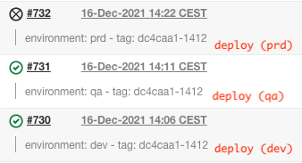

# yoke


* [About](#about)
  * [Motivation](#motivation)
  * [How it works](#how-it-works)
  * [Origin](#origin)
* [Installation](#installation)
* [Usage](#usage)
  * [Update](#update)
  * [Install](#install)
  * [Helpers](#helpers)
  * [Deployment Controllers](#deployment-controllers)
    * [ECS: Rolling Update](#ecs-rolling-update)
    * [EXTERNAL: Canary Release](#external-canary-release)
* [Extra](#extra)
  * [Provisioning: Terraform](#provisioning-terraform)
    * [Mixed: managed and live (migrating to Update mode)](#mixed-managed-and-live-migrating-to-update-mode)
    * [Afterwards: live only (migrating to Install mode)](#afterwards-live-only-migrating-to-install-mode)
    * [Bootstrap: live only, with bogus (creating from scratch)](#bootstrap-live-only-with-bogus-creating-from-scratch)
  * [Templates](#templates)
    * [Deployment](#deployment)
    * [Pipelines: Jenkins](#pipelines-jenkins)
  * [Application configuration override](#application-configuration-override)
    * [Ktor and Jib](#ktor-and-jib)
    * [Spring Boot and Dockerfile](#spring-boot-and-dockerfile)
* [Contributing](#contributing)
  * [Tests](#tests)
  * [Contributions](#contributions)
* [License](#license)

# About

`yoke` is a simple tool for deploying services on [Amazon Elastic Container Service](https://aws.amazon.com/ecs/) (AWS ECS). Its approach tries supporting [Continuous Delivery](https://continuousdelivery.com/), decoupling resources **provisioning** from application **deployment**, ensuring you can:

* **deploy a given application version**, to rollout new versions, or rollback to a previous version
* **build once, deploy everywhere**, decoupling build and deploy processes, given we correlate application version and deployment descriptors
* **keep application and deployment descriptors close together**, ensuring they stay in synch

# Motivation

In [GuccioGucci](https://github.com/GuccioGucci/) we've been using `ECS` for a long time, with a common setup: [Terraform](https://www.terraform.io/) for managing much of resource provisioning, and [`aws` cli](https://aws.amazon.com/cli/) for performing application deployment. We also relied on `FARGATE` launch type, wich ensure `ECS` is managing resources with no additional operations required.

When we tried applying Continuous Delivery, we faced the main issue with ECS: task definitions are *managed* resources as well, so created, updated and deleted by interacting with ECS, which track individual revisions for every change. In other words, While deploying services, we have to reference individual task definition revision.

One initial approach was keeping task definitions *stable*, while deploying *updated* application versions. This was achieved by using per-environment Docker image tags (eg: `application:dev`, `application:qa` and `application:prd`), and relying on **build** pipeline pushing new image version, and **deployment** pipeline tagging image accordingly to target environment. Then, it was just a matter of forcing a new deployment `(--force-new-deployment`) with [aws ecs update-service](https://awscli.amazonaws.com/v2/documentation/api/latest/reference/ecs/update-service.html). But on the long run, even this approach was not enough.

Then, we faced it was not so easy to automatically evolve application code to use new configuration values (eg: injected as environment variables), since this typically required to prepare parameters with `aws` cli first, then enriching task-definition in Terraform modules and applying those changes. Two manual steps, before the new application version could be deployed. And this process had to be replicated in every `ECS` environment (eg: `dev`, `qa` and `prd`).

We then started looking for something supporting our scenario, and found it was quite common. Even if no single tooling existed matching our context, it was easy to glue together few open-source tools. Next section will explain how.

## How it works

Frankly speaking, it's just a wrapper around other tools (actually, [enriched forks](#contributing)):
* [silinternational/ecs-deploy](https://github.com/silinternational/ecs-deploy): simple script for deploying to AWS `ECS`. Itself, it's a wrapper around `aws` and `jq`
* [noqcks/gucci](https://github.com/noqcks/gucci): standalone [Go template engine](https://golang.org/pkg/text/templates/). (Isn't it funny that it is named `gucci`? Really!)

So, `yoke` it's mainly composing an `ecs-deploy` command-line, and additionally preparing a proper actual task-definition file, from given template and "values" YAML files (holding per-environment data).

## Origin

It was initially inspired by past experience with [Helm](https://helm.sh/), which is the [Kubernetes](https://kubernetes.io/) (k8s) package manager (in few words, the tool to discover and install k8s applications -- *charts* in Helm jargon).

Then the analogy was: `helm` (the ship's wheel) is for `k8s` (again, whit a seven spokes wheel icon) what `yoke` (the control wheel for airplanes) is for `ECS` (the "cloud")!

Anyway, if you don't get it, sounds like "joke".


# Installation

These are the dependencies required to be installed, part of them are from `ecs-deploy` [required dependencies](https://github.com/silinternational/ecs-deploy#installation):

* [aws](https://docs.aws.amazon.com/cli/latest/userguide/getting-started-install.html) cli (version 2)
* [jq](https://github.com/stedolan/jq/wiki/Installation)
* [coreutils](https://www.gnu.org/software/coreutils/)
* [curl](http://curl.haxx.se/)
* [git](https://git-scm.com/)

Additional dependencies (for both application and tests) expected to be available in the `PATH` will be automatically installed on first execution.

Given it's a `bash` script, it should be supported in most Unix-like OS. Most of development is done on MacOs, while automatic tests are run on Linux (Ubuntu and CentOS). On Windows, you'd probably only need a bash prompt such as [Git bash](https://gitforwindows.org/), [Cygwin](https://www.cygwin.com/) or similar (we succesfully tested on Windows 10 with `Git bash`, `aws` and `jq` - no extra `coreutils` and `curl` required). Anyway downloaded binaries are OS specific (eg: `gucci` is available for Windows starting from version `1.5.x`, 64-bit only at the moment).

Since at the moment the tool is available as source code only (but planned to be distributed with source and/or binary releases), here's how to install it:

```
$ git clone https://github.com/GuccioGucci/yoke.git
$ cd yoke
$ ./yoke --version

Updating ecs-deploy (GuccioGucci/ecs-deploy)
Updating gucci (gucci-v1.5.2-darwin-amd64)
Updating bats (sstephenson/bats)
Updating bats-assert (ztombol/bats-assert)
Updating bats-support (ztombol/bats-support)
(templating) gucci: gucci version 1.5.1
(deployment) ecs-deploy: 3.10.3
```

# Usage

In order to use it, please ensure you have a proper AWS setup, ensuring `AWS_ACCESS_KEY_ID` and `AWS_SECRET_ACCESS_KEY` environment variables are set, or alternatively `AWS_SHARED_CREDENTIALS_FILE` only. Please, remember also to configure default region, by choosing "Default region name" value with `aws configure`, or setting `AWS_DEFAULT_REGION` environment variable.

Usage help:

```
usage: ./yoke command [parameters]

command:
    update                  update remote task definition with given image tag
    install                 install local task definition (task-definition.json.tmpl), using given image tag

parameters:
    -h|--help               show this usage
    -v|--version            show version info
    -d|--debug              debug mode, verbose (default: false)
    -c|--cluster value      ecs cluster (eg: cls01)
    -s|--service value      ecs service (eg: hello-world-dev)
    -t|--tag value          Docker image tag (eg: 8a5f3a7-88)
    -w|--working-dir value  where to search for resources (default: deployment)
    -f|--values value       values file (eg: values-dev.yaml)
    --prune value           only keep given task definitions (eg: 5)
    --timeout value         timeout (default: 300)
    --dry-run               dry-run mode, avoid any deployment (default: true)
```

`yoke` supports two different modes: **update** mode and **install** mode. Given your context (migrating an existing application, or developing a new application) you can choose the one that fits you best. Please, see next sections for details, and [Provisioning: Terraform](#provisioning-terraform) section to understand the impact on resource provisioning.

## Update

Update an existing task definition, with a given image tag (short and long versions):
```
./yoke update -c cls01 -s hello-world-dev -t bb255ec-93
./yoke update --cluster cls01 --service hello-world-dev --tag bb255ec-93
```

This will grab the *current* task definition (for given `cls01` cluster and `hello-world-dev` service), update main container definition to use the given image tag (`bb255ec-93`), create a new revision for the task definition, and finally force a new deployment. Once done, newly created task definition will be the *current* one.

## Install

Install local task definition, with image tag (short and long versions):
```
./yoke install -c cls01 -s hello-world-dev -t bb255ec-93 -w test/samples/hello-world/deployment -f values-dev.yaml
./yoke install --cluster cls01 --service hello-world-dev --tag bb255ec-93 --working-dir test/samples/hello-world/deployment --values values-dev.yaml
```

This will prepare a local task definition, starting from a template (expected to be `task-definition.json.tmpl`), apply the proper template substitutions (using given `values-dev.yaml` file as source), create a new revision for the task definition (starting from the local one, just created), and finally force a new deployment. Once done, newly created task definition will be the *current* one.

Both task definition template (`task-definition.json.tmpl`) and values file (`values-dev.yaml` in the example) are expected to be found in the working directory (default to `deployment`, set to `test/samples/hello-world/deployment` in the example). Relying on the default, it would be:
```
deployment/
├── task-definition.json.tmpl
├── values-dev.yaml
├── values-qa.yaml
└── values-prd.yaml
```

Expected `task-definition.json.tmpl` content is a JSON file, with a `taskDefinition` root node matching the [aws ecs register-task-definition](https://awscli.amazonaws.com/v2/documentation/api/latest/reference/ecs/register-task-definition.html) JSON syntax. Here's a minimal template, see [Deployment](#deployment) Templates section for a complete example:

```
{
  "taskDefinition": {
    "family": "...",
    "executionRoleArn": "...",
    "taskRoleArn": "...",
    "placementConstraints": [ ],
    "requiresCompatibilities": [ "FARGATE" ],
    "networkMode": "...",
    "cpu": "...",
    "memory": "...",
    "volumes": [ ],
    "containerDefinitions": [
      {
        "name": "application",
        "image": "...",
        "portMappings": [ { "containerPort": ... } ],
        "environment": [ ],
        "secrets": [ ]
      }
    ]
  }
}
```

## Helpers

While preparing template content, you can use much of Go templating functions: for example, declaring variables, `if` statements, boolean functions and so on. Also, Sprig functions are supported. Please, see [here](https://github.com/noqcks/gucci#templating) for the full list of supported functions and options.

In addition to that, we prepared some useful helper scripts (already available into `PATH`), that you can use with the `shell` function. Following sections will recap them (see [helpers](bin/helpers) for details, and [helpers.bats](test/helpers.bats) for usage examples).

One last note, custom helpers are also supported. They're expected to be found in `bin` folder, under current working-dir. For example, you can define a custom `my_helper` script and run it from the task definition template:

```
deployment/
└── bin/
    └── my_helper
```

```
"executionRoleArn": "{{ shell "my_helper hello-world-" .environment.name }}"
```

### aws_account_id

Get current Account id.

* Usage: `aws_account_id`
* Example:
```
"executionRoleArn": "arn:aws:iam::{{ shell "aws_account_id" }}:role/hello-world-{{ .environment.name }}"
```

### aws_iam_role

Get [IAM](https://aws.amazon.com/iam/) Role by name, then extract ARN.

* Usage: `aws_iam_role $NAME`
* Example (this is equivalent to the previous one):
```
"executionRoleArn": "{{ shell "aws_iam_role hello-world-" .environment.name }}"
```

### aws_efs_ap

Get [EFS](https://aws.amazon.com/efs/) Access Point by `Name` tag, then extract requested attribute. `Name` tag usage is required since there is no clear id on those resources. So, to be uniquely identified, please add this tag to desired access points, in your provisioning configuration (eg: Terraform module).

* Usage: `aws_efs_ap $NAME $ATTRIBUTE`
* Example:
```
"fileSystemId": "{{ shell "aws_efs_ap hello-world-" .environment.name "-efs fileSystemId" }}"
...
"accessPointId": "{{ shell "aws_efs_ap hello-world-" .environment.name "-efs accessPointId" }}"
```

### aws_lb_target_group

Get Load Balancer Target Group by name, then extract ARN.

* Usage: `aws_lb_target_group $NAME`
* Example:
```
"targetGroupArn": "{{ shell "aws_lb_target_group hello-world-" .environment.name "-tg" }}"
```

### aws_security_group

Get Security Group by name, then extract ARN.

* Usage: `aws_security_group $NAME`
* Example:
```
"securityGroups": [ "{{ shell "aws_security_group hello-world-" .environment.name "-sg" }}" ]
```

### aws_subnet

Get Subnet by name, then extract ARN.

* Usage: `aws_subnet $NAME`
* Example:
```
"subnets": [
  "{{ shell "aws_subnet nonprod-az1" }}",
  "{{ shell "aws_subnet nonprod-az2" }}"
]
```

## Deployment Controllers

AWS ECS services can be configured to be provisioned with specific [deployment controller](https://docs.aws.amazon.com/AmazonECS/latest/APIReference/API_DeploymentController.html). By default, it would be `ECS` (fully managed deployments). Alternatively, you can configure `CODE_DEPLOY` (unsupported, as it implies using AWS CodeDeploy) and `EXTERNAL` (for delegating third-party component, actually `yoke` itself).

### ECS: Rolling Update

Currently, we mainly promote using `yoke` with services provisioned as `ECS`. Both **update** and **install** modes would then rely on ECS for managing the deployments lifecycle. It would result in a [Rolling Update](https://docs.aws.amazon.com/AmazonECS/latest/developerguide/deployment-type-ecs.html), described as:

> ... replacing the current running version of the container with the latest version. The number of containers Amazon ECS adds or removes from the service during a rolling update is controlled by adjusting the minimum and maximum number of healthy tasks allowed during a service deployment, as specified in the DeploymentConfiguration.


Here's a sample execution:

```
 ./yoke install -c cls01 -s hello-world-dev -t bb255ec-93 -w test/samples/hello-world/deployment -f values-dev.yaml
 
 (1) [2021-01-05 16:34:33] values: test/samples/hello-world/deployment/values-dev.yaml
 (2) [2021-01-05 16:34:33] task-definition: test/samples/hello-world/deployment/task-definition.json.tmpl
 (3) [2021-01-05 16:34:33] (current) task-definition: /tmp/task-definition.json.17213
 (4) Deployment controller: ECS
 (5) Using image name: bb255ec-93
 (6) Current task definition: arn:aws:ecs:us-east-1:1234567890:task-definition/hello-world-dev:10
 (7) New task definition: arn:aws:ecs:us-east-1:1234567890:task-definition/hello-world-dev:11
 (8) .......
 (9) Service updated successfully, new task definition running.
(10) Waiting 300s for service deployment to complete...
(11) ..............................................
(12) Service deployment successful.
```

By default, it will:

* create new fully-sized deployment (`7`-`9`)
* wait for new deployment to be steady (`10`-`12`)

Once `yoke` execution is completed, ECS is still disposing previous deployment, which is no more load-balanced (and so, safely disposable).

## EXTERNAL: Canary Release

Experimental support for `EXTERNAL` deployment controller is in progress, supporting [Canary Release](https://martinfowler.com/bliki/CanaryRelease.html). This requires `yoke` to manage not only task definitions, but also task sets (actually, *managed* deployments). Once remote service is detected to be configured as `EXTERNAL`, both **update** and **install** modes would then manage the deployment lifecycle, enriching `ecs-deploy` command line to do so (see [contributions](#contributions) section for details and [deployment.bats](test/deployment.bats) for sample usages).

For **install** mode only, in addition to `task-definition.json.tmpl`, you can provide a `task-set.json.tmpl` file as well, again expected to be found in the working directory, eg:

```
deployment/
├── task-definition.json.tmpl
├── task-set.json.tmpl
└── values-dev.yaml
```

Expected `task-set.json.tmpl` content is a JSON file, with a `taskSet` root node matching [aws ecs update-task-set request](https://awscli.amazonaws.com/v2/documentation/api/latest/reference/ecs/update-task-set.html) JSON syntax. Here's an example:

```
{
  "taskSet": {
    "networkConfiguration": { ... },
    "loadBalancers": [ { ... } ],
    "serviceRegistries": [ ],
    "launchType": "FARGATE",
    "platformVersion": "LATEST",
    "scale": {
      "value": 100,
      "unit": "PERCENT"
    }
  }
}
```

Please, consider the impact on provisioning, once you configure `EXTERNAL` deployment controller, eg: removing resources from Terraform (see [Provisioning: Terraform](#provisioning-terraform) section).

Here's a sample execution:

```
 (1) [2021-01-05 16:38:00] values: test/samples/hello-world-x/deployment/values-dev.yaml
 (2) [2021-01-05 16:38:00] confirmation: test/samples/hello-world-x/deployment/bin/confirm.sh.tmpl
 (3) [2021-01-05 16:38:00] (current) confirmation: /tmp/confirm.sh.7947
 (4) [2021-01-05 16:38:00] task-definition: test/samples/hello-world-x/deployment/task-definition.json.tmpl
 (5) [2021-01-05 16:38:00] (current) task-definition: /tmp/task-definition.json.12699
 (6) [2021-01-05 16:38:02] task-set: test/samples/hello-world-x/deployment/task-set.json.tmpl
 (7) [2021-01-05 16:38:02] (current) task-set: /tmp/task-set.json.25561
 (8) Deployment controller: EXTERNAL
 (9) Using image name: bb255ec-93
(10) Current task definition: arn:aws:ecs:us-east-1:1234567890:task-definition/hello-world-x-dev:11
(11) New task definition: arn:aws:ecs:us-east-1:1234567890:task-definition/hello-world-x-dev:12
(12) Creating new canary deployment of the service
(13) Current deployments
(14) {"externalId":"stable-20210501-172006","status":"ACTIVE","scale":"100%","desired":4,"pending":0,"running":4}
(15) {"externalId":"canary-20210501-163811","status":"ACTIVE","scale":"25%","desired":0,"pending":0,"running":0}
(16) Waiting 300s for service deployment to complete...
(17) .................
(18) Service deployment successful.
(19) 
(20) Waiting 10s...
(21) ..........
(22) Creating new stable deployment of the service
(23) Waiting 300s for service deployment to complete...
(24) ............
(25) Service deployment successful.
(26) 
(27) Deleting previous (stable) deployment of the service
(28) Deleting canary deployment of the service
(29) Current deployments
(30) {"externalId":"stable-20210501-163909","status":"ACTIVE","scale":"100%","desired":4,"pending":0,"running":4}
(31) {"externalId":"stable-20210501-172006","status":"DRAINING","scale":"0%","desired":4,"pending":0,"running":4}
(32) {"externalId":"canary-20210501-163811","status":"DRAINING","scale":"0%","desired":1,"pending":0,"running":1}
```

At the moment, **Canary Release** strategy is the following:

* create *new canary* deployment, scaled to 25% of desired size (`11`-`15`)
* wait for *new canary* deployment to be steady (`16`-`18`)
* apply confirmation strategy, custom or default to `wait_timeout` (`20`-`21`)
* create *new stable* deployment, scaled to 100% of desired size (`22`)
* wait for *new stable* deployment to be steady (`23`-`25`)
* delete *existing stable* deployment (`27`)
* delete *new canary* deployment (`28`)

Custom **confirmation strategy** can be prepared, by defining a `confirm.sh.tmpl` script (see [confirm.sh.tmpl](test/samples/hello-world-x/deployment/bin/confirm.sh.tmpl) as an example). It's expected to `exit 0` while ready to proceed, and to be found in `bin` folder, under current working-dir:

```
deployment/
└── bin
    └── confirm.sh.tmpl
```

# Extra

This section contains resources and guidelines in adopting the process. Please, consider this additional contribution as being very specific to what we've been using in [GuccioGucci](https://github.com/GuccioGucci/), anyway we hope it's common enough to be useful to you as well.

## Provisioning: Terraform

You're probably guessing what's the impact on provisioning, once we move task-definition out of Terraform scope (since task-definition in `ECS` are managed resources, with individual revisions). Here's an [interesting discussion on the topic](https://github.com/hashicorp/terraform-provider-aws/issues/632), with alternative approaches.

We'll recap them here, with examples, using the following as reference scenario: a shared `module.tf`, with common definitions, and per-environment `$stage/main.tf` files (eg: `dev/main.tf`, `qa/main.tf` and `prd/main.tf`).

### Mixed: managed and live (migrating to Update mode)

One approach is to rely on both a `resource` for *managed* task definition, and also a `data` to get current *live* task definition in the `ECS` environment. Then, on task definition `resource`, you can pick the "latest" one, being either *managed* or *live* one (latest meaning being the biggest of them).

Here's an example:

```
resource "aws_ecs_task_definition" "td" {
  family = ...
  ...
}

data "aws_ecs_task_definition" "current_td" {
  task_definition = aws_ecs_task_definition.td.family
}

resource "aws_ecs_service" "esv" {
  task_definition = "${aws_ecs_task_definition.td.family}:${max(aws_ecs_task_definition.td.revision,data.aws_ecs_task_definition.current_td.revision)}"
  ...
```

### Afterwards: live only (migrating to Install mode)

Another approach, going even further, is getting rid of `resource` for *managed* task definition, and only relying on `data` for *live* task definition, using it to configure the service. Of course, this can only be achieved once the task definition has already been created! So for example, that could be done to migrate an existing service, from a previously "all-managed" approach.

Here's an example:

```
data "aws_ecs_task_definition" "current_td" {
  task_definition = ...
}

resource "aws_ecs_service" "esv" {
  task_definition = "${data.aws_ecs_task_definition.current_td.family}:${data.aws_ecs_task_definition.current_td.revision}"
  ...
}
```

### Bootstrap: live only, with bogus (creating from scratch)

Even better, we could always rely on *already existing* task definitions, with a little trick: using some default "off-the-shelf" ones the very first time (on creation), then following previous solution (*live* only), afterwards.

This sounds like a ["chicken and egg" problem](https://en.wikipedia.org/wiki/Chicken_or_the_egg): having a task definition already prepared *before* the very first application deploy (which holds the actual task definition). For reference, this was inspired by [this approach](https://github.com/hashicorp/terraform-provider-aws/issues/632#issuecomment-472420686), from the previously shared discussion on the topic.

In order to do so, we need to:

* distinguish *first* and *following* `terraform apply` executions
* prepare "off-the-shelf" task definitions (referred to as `bogus`)

First goal can be achieved using a variable on command-line (e.g. `bootstrap`), being `false` by default and set `true` on first execution. Here's an example:

```
# first time
terraform apply -var bootstrap=true

# following executions
terraform apply
```

So the only change, in respect to previous example, is to pick the proper task definition, accordingly to `bootstrap`.

* `module.tf`
```
variable "bootstrap" {}

locals {
  ...
  container_port = 8090
  task_definition_family = var.bootstrap ? "bogus-${local.container_port}" : "${local.svc_name}-${var.stage}"
}

data "aws_ecs_task_definition" "current_td" {
  task_definition = local.task_definition_family
}
```

* `$stage/main.tf`
```
variable "bootstrap" {
  default = false
}

module "main" {
  ...
  bootstrap = var.bootstrap
}
```

For achieving second goal, we prepared a [bogus Docker image](docker/bogus), with a minimal [Nginx](https://www.nginx.com/) website, always replying with a `200 OK` response on any endpoint. This is ideal for emulating a proper health-check, as it would be for the real application.

This Docker image is expected to be built and pushed to your reference Docker registry (`ECR` or private one), and then referenced in dedicated `bogus` task definitions. Suggested approach is provisioning one task definition for every exposed HTTP port, eg: `bogus-80`, `bogus-8080`, `bogus-8090` and the like. Here's a sample Terraform snippet for doing so:

```
variable "container_ports" {
  type        = list(string)
  default     = ["80", "8080", "8090" ... ]
}

resource "aws_ecs_task_definition" "td" {
  count = length(var.container_ports)
  family = "bogus-${var.container_ports[count.index]}"
  container_definitions = <<EOF
[
    {
      "name": "application",
      "image": "$DOCKER_REGISTRY$/bogus:latest",
      "environment": [
        { 
          "name": "NGINX_PORT",
          "value": "${var.container_ports[count.index]}"
        }
      ],
      "portMappings": [
        {
            "containerPort": ${var.container_ports[count.index]}
        }
      ],
      "cpu" : 0,
      "volumesFrom": [ ],
      "mountPoints": [ ],
      "essential": true
    }
  ]
EOF
  memory = ...
  cpu = ...
  execution_role_arn = ...
  network_mode = ...
  requires_compatibilities = [
    "FARGATE",
  ]
}
```

Please, note that in order to migrate from *bogus* to *application* task definition, you have to keep the same container **name**, otherwise the the load balancer would fail to re-configure (`application` in the above example). Ensure you're using the same in `ECS` service definition:

```
resource "aws_ecs_service" "esv" {
  ...
  load_balancer {
    ...
    container_name = "application"
  }
}
```

## Templates

### Deployment

A deployment template is provided in [templates/deployment](templates/deployment). Copy & paste it in your application sources, for example on root folder.

Sample values files should be ready to be used, while you should edit [`task-definition.json.tmpl`](templates/deployment/task-definition.json.tmpl):

* replace `${APPLICATION}` with your application name. This is also expected to be the Docker repository image name
* replace `${CONTAINER_PORT}` with load-balanced HTTP port for your application, as in your provisioning configuration (eg: Terraform)
* replace `${SERVICE}` with your service name, in order match `${SERVICE}-{{ .environment.name }}` with your provisioning configuration (eg: Terraform)

### Pipelines: Jenkins

While integrating with [Jenkins](https://www.jenkins.io/), one possible approach is using one **main** pipeline for orchestrating build, test and deployment on all environments (`dev`, `qa` and `prd`), while delegating deployment to a dedicated **deploy** pipeline.


The **main** pipeline would build application version for a given commit (`BRANCH` parameter), while the **deploy** pipeline would be executed multiple times, deploying the very same Docker image (`TAG` parameter) on individual environments (`ENVIRONMENT` parameter). Deployment on each environment other than `dev` will be asked for confirmation (with `input` step), on `master` branch only (please, change it to match your *trunk* branch naming).



For doing so, sample templates are provided in [templates/pipeline](templates/pipeline):

* [`Jenkinsfile`](templates/pipeline/Jenkinsfile) is the **main** pipeline
  * set `APPLICATION` to your application name. This is also expected to be the Docker repository image name
  * create a Jenkins job using this `Jenkinsfile` as the pipeline
* [`Jenkinsfile.deploy`](templates/pipeline/Jenkinsfile.deploy) is the **deploy** pipeline, interacting with `yoke` in order to deploy on `ECS`
  * set `APPLICATION` to your application name (as in previous step)
  * set `SERVICE` to your service name, in order match `${params.ENVIRONMENT}-${SERVICE}` with your Terraform configuration
  * customize any `prd`-specific tasks that you want to perform (eg: configuring AWS profiles and/or promoting images from nonprod to prod Docker registries)
  * create a Jenkins job using this `Jenkinsfile.deploy` as the pipeline, named `${APPLICATION}_deploy`

Then, in `Jenkinsfile.deploy` please consider using in a specific tag instead of relying on `main` branch, in order to keep control of `yoke` version. To do so, please set `YOKE_VERSION` to any available tag. See [CHANGELOG](CHANGELOG.md) for details about individual versions.

## Application configuration override

Given task-definition is prepared at deploy-time, it could be used to override application configurations, with external resources. For example, you can prepare environment-specific application configuration override files, under same working-dir folder (eg: `deployment/config`):

```
deployment/
└── config/
    ├──dev/
    │  └── application-override.conf
    ├──qa/
    │  └── application-override.conf
    └──prd/
       └── application-override.conf
```

In other words, this would allow configuring the bare minimum environment variables possible (while still adhering to [12 Factor App](https://12factor.net/config) approach). For example, cleaning up `environment` node, only leaving those used by `Dockerfile` or other resources
. On the other hand, we'd preserve `secrets` node (then being injected as environment variables as well).

For doing so, we can leverage on language or framework specific techniques for injecting complete or partial application configuration files, for a given environment, at run-time. See following sections for few specific examples.

The overall approach is documented [here](https://kichik.com/2020/09/10/mounting-configuration-files-in-fargate/), and it's easily adapted from CloudFormation. In few words:

* a dedicated *ephemeral* `application-config` container is defined, with the only purpose of creating a dedicated configuration file. Configuration file's content is read from a `DATA` environment variable
* `application` container depends on `application-config` container to be `COMPLETE`, so it can then terminate once done (see [here](https://docs.aws.amazon.com/AmazonECS/latest/APIReference/API_ContainerDependency.html) for reference). This is to ensure configuration file would already be prepared, at application startup
* `DATA` environment variable into `application-config` container definition is then valued with original file content, encoded to base64 (that should preserve any special char and newlines)

Here's a draft `task-definition.json.tmpl`:

```
{{/*
  $configurationPath and $applicationConfigurationOverride are set to match Docker configuration (eg: Jib, Dockerfile or other tooling for preparing Docker images)
  please keep them in synch, would they be migrated.
*/}}
{{- $applicationConfigurationOverride := "..." -}} # eg: application-override.yaml
{{- $configurationPath := "..." -}} # eg: /app/config
{
  "taskDefinition": {
   ...
    "volumes": [
      {
        "host": { },
        "name": "application-config"
      }
    ],
    "containerDefinitions": [
      {
        "name": "application",
        ...
        "dependsOn": [
          {
            "containerName": "application-config",
            "condition": "COMPLETE"
          }
        ],
        "mountPoints": [
          {
            "containerPath": "{{ $configurationPath }}",
            "sourceVolume": "application-config"
          }
        ]
      },
      {
        "name": "application-config",
        "essential": false,
        "image": "bash",
        "command": [
          "-c",
          "echo $DATA | base64 -d - | tee {{ $configurationPath }}/{{ $applicationConfigurationOverride }}"
        ],
        "environment": [
          {
            "name": "DATA",
            "value": "{{ shell "openssl base64 -A -in config/" .environment.name "/" $applicationConfigurationOverride }}"
          }
        ],
        "mountPoints": [
          {
            "containerPath": "{{ $configurationPath }}",
            "sourceVolume": "application-config"
          }
        ]
      }
    ]
  }
}
```

### Ktor and Jib

For example, with [Ktor](https://ktor.io/) and [Jib](https://github.com/GoogleContainerTools/jib), you'd probably need:

```
{{- $applicationConfigurationOverride := "application-override.conf" -}}
{{- $configurationPath := "/app/resources/config" -}}
```

Then, you only need to enable overriding in `Ktor` application config, relying on [HOCON "include"](https://github.com/lightbend/config/blob/main/HOCON.md#includes) capability, adding this as the very last line in application.conf file:
```
include "config/application-override.conf"
```

### Spring Boot and Dockerfile

For [Spring Boot](https://spring.io/projects/spring-boot) application, you could use:

```
{{- $applicationConfigurationOverride := "application-override.properties" -}} # or application-override.yaml
{{- $configurationPath := "/opt/service/config" -}} # as configured in your Dockerfile or base Docker image
```

Then, add this to application startup command line (eg: `Dockerfile`, `bootstrap.sh` or equivalent):

```
java -jar service.jar ... \
     --spring.config.additional-location=config/application-override.properties # or application-override.yaml
```

# Contributing

## Tests

Yes, it's tested! We were able to cover basic command-line parsing, and even tested expected interaction with `ecs-deploy`, relying on a [fake version](test/fake/lib/ecs-deploy). So, no real AWS integration happening, test execution is safe!

To run tests, execute:

```
./build.sh
```

These are the libs we're using:

* https://github.com/sstephenson/bats
* https://github.com/ztombol/bats-docs
  * https://github.com/ztombol/bats-support
  * https://github.com/ztombol/bats-assert

Additionally, in [GuccioGucci](https://github.com/GuccioGucci/) we take care of ensuring end-to-end build and deployment is still working, with few sample applications, on our AWS `ECS` clusters (and then using `yoke` in our daily deployments).

## Contributions

Here's a list of contributions we did to involved open-source projects:

* [silinternational/ecs-deploy](https://github.com/silinternational/ecs-deploy) (forked to [GuccioGucci/ecs-deploy](https://github.com/GuccioGucci/ecs-deploy))
  * confirmed a bug on task-definition file not working, [here](https://github.com/silinternational/ecs-deploy/pull/215)
  * PR to migrate `--tag-only` to apply on main container definition only (being the first one), [here](https://github.com/silinternational/ecs-deploy/pull/227)
  * PR to support canary releases on `EXTERNAL` deployments, [here](https://github.com/silinternational/ecs-deploy/pull/231)
* [noqcks/gucci](https://github.com/noqcks/gucci) (forked to [GuccioGucci/gucci](https://github.com/GuccioGucci/gucci))
  * PR on enriching shell function to support multiple arguments, [here](https://github.com/noqcks/gucci/pull/30)

Note that while waiting for some PR to be merged, we're using forks.

# License

Copyright 2021 Gucci.

Licensed under the [GNU Lesser General Public License, Version 3.0](http://www.gnu.org/licenses/lgpl.txt)